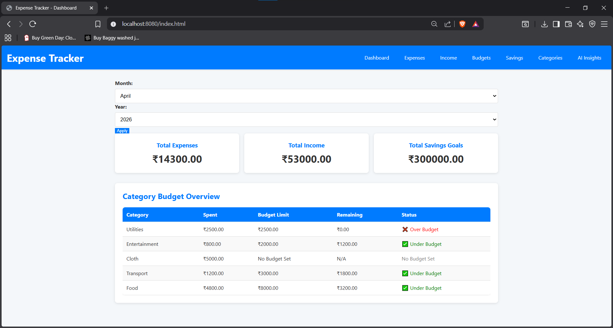
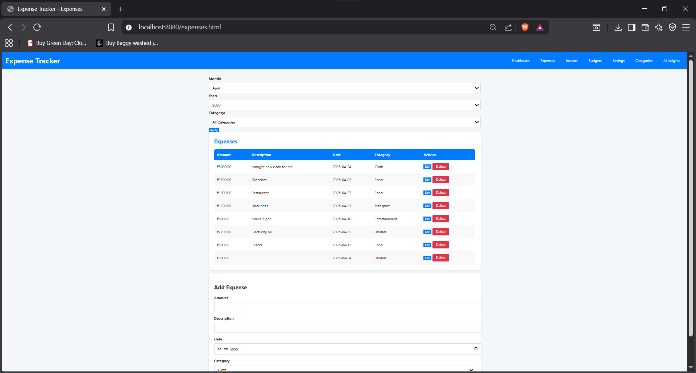
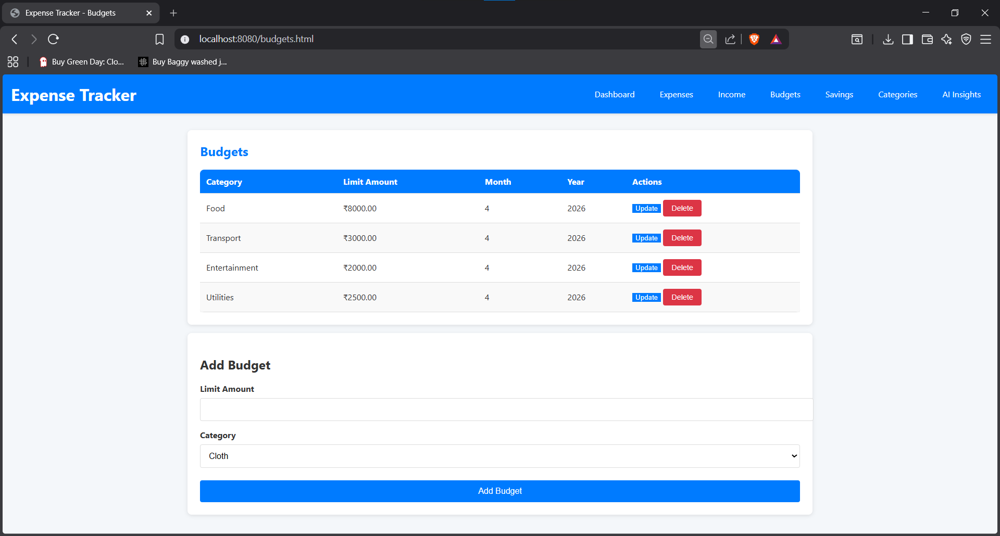
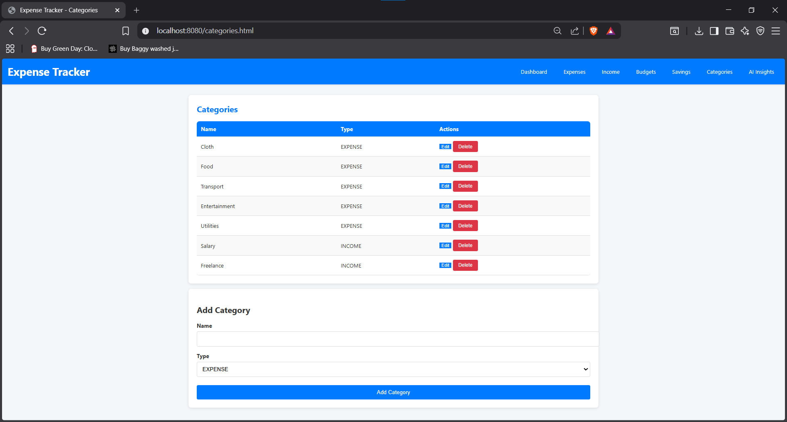
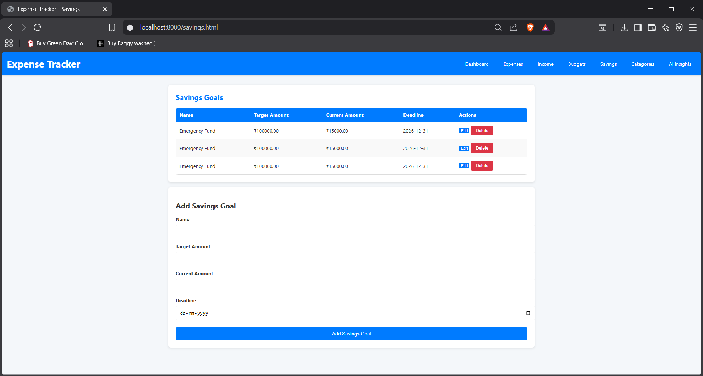
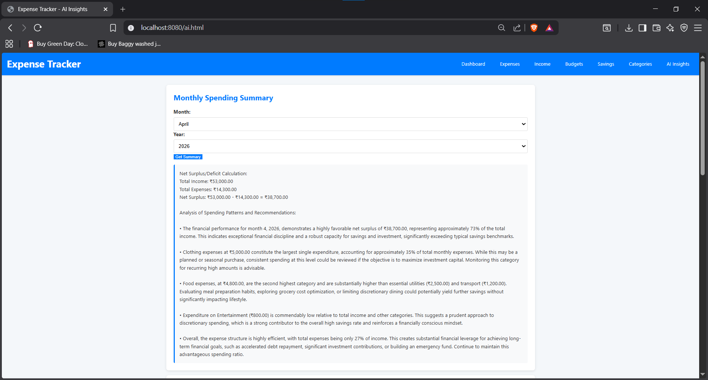
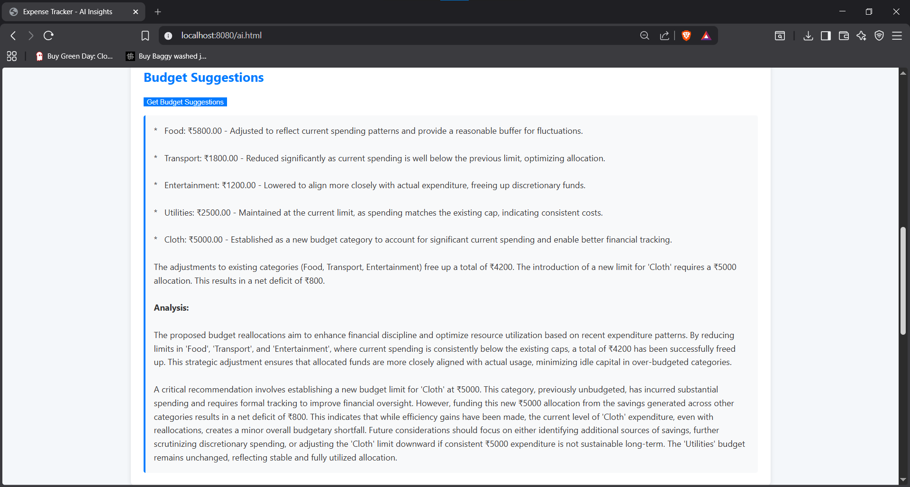
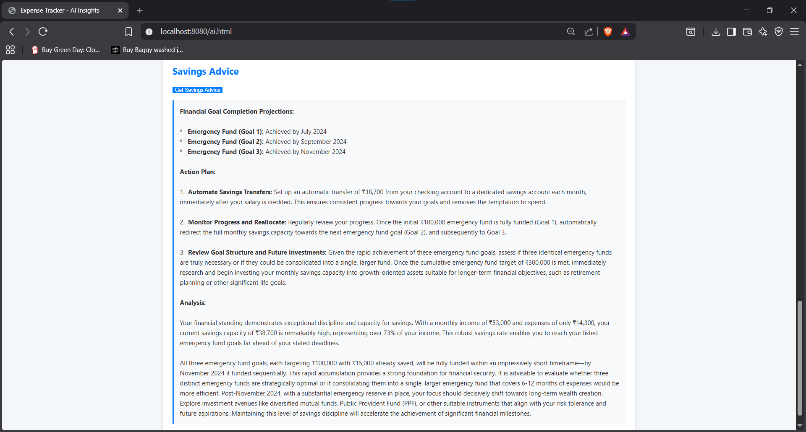

# 💸 Expense Tracker & Budget Manager

A full-stack personal finance web application built with **Spring Boot**, **PostgreSQL**, and **Google Gemini AI** — designed to help users track expenses, manage budgets, and get AI-powered financial insights.

---

## ✨ Features

- **Dashboard** — Overview of total income, expenses, and savings goals for any selected month/year
- **Expense & Income Tracking** — Full CRUD with category assignment, date filtering, and inline editing
- **Category Budget Overview** — Table showing spent vs. budget limit per category with status indicators (Under Budget / Near Limit / Over Budget)
- **Monthly Budget Limits** — Set per-category spending caps and track usage
- **Savings Goals** — Define and track progress toward savings targets with deadlines
- **Custom Categories** — Create EXPENSE or INCOME type categories
- **AI Insights (Gemini)** — Monthly spending summary, budget suggestions, and savings advice powered by Google Gemini 2.5 Flash

---

## 📸 Screenshots

### Dashboard


### Expenses


### Budgets


### Categories


### Saving Goals


### AI Insights




---

## 🛠️ Tech Stack

| Layer       | Technology                              |
|-------------|-----------------------------------------|
| Backend     | Java 17, Spring Boot 3.5.13             |
| Frontend    | Plain HTML, CSS, JavaScript             |
| Database    | PostgreSQL, Spring Data JPA (Hibernate) |
| AI          | Google Gemini API (`gemini-2.5-flash`)  |
| Build Tool  | Maven                                   |
| IDE         | IntelliJ IDEA                           |

---

## 📁 Project Structure

```
src/
└── main/
    ├── java/com/expensetracker/
    │   ├── model/          # JPA entities (Expense, Income, Category, Budget, SavingsGoal, User)
    │   ├── repository/     # Spring Data JPA repositories
    │   ├── service/        # Business logic layer
    │   └── controller/     # REST API controllers
    └── resources/
        ├── static/         # HTML, CSS, JS files
        └── application.properties
```

---

## ⚙️ Getting Started

### Prerequisites

- Java 17+
- PostgreSQL 14+
- Maven 3.x
- A [Google Gemini API key](https://aistudio.google.com/app/apikey)

### 1. Clone the repository

```bash
git clone https://github.com/aditya2k413/expense-tracker.git
cd expense-tracker
```

### 2. Create the PostgreSQL database

```sql
CREATE DATABASE expense_tracker;
```

### 3. Configure `application.properties`

Create `src/main/resources/application.properties` (see `application.properties.example` as a reference):

```properties
spring.datasource.url=jdbc:postgresql://localhost:5432/expense_tracker
spring.datasource.username=your_postgres_username
spring.datasource.password=your_postgres_password
spring.datasource.driver-class-name=org.postgresql.Driver

spring.jpa.hibernate.ddl-auto=update
spring.jpa.show-sql=true
spring.jpa.properties.hibernate.format_sql=true

spring.application.name=expense-tracker

gemini.api.key=your_gemini_api_key
```

> ⚠️ `application.properties` is listed in `.gitignore` and must never be committed with real credentials.

### 4. Run the application

```bash
mvn spring-boot:run
```

Visit `http://localhost:8080` in your browser.

---

## 🤖 AI Features

Integrates Google Gemini (`gemini-2.5-flash`) to provide:

- **Monthly Spending Summary** — Analyzes income vs. expenses by category for a selected month/year
- **Budget Suggestions** — Recommends revised budget limits based on actual spending patterns
- **Savings Advice** — Calculates projected goal completion dates and provides a prioritized action plan

---

## 🔒 Security Note

`application.properties` is excluded from version control via `.gitignore`. Use `application.properties.example` as a setup reference. Never commit real credentials.

---

## 👤 Author

**Aditya** — [@aditya2k413](https://github.com/aditya2k413)
